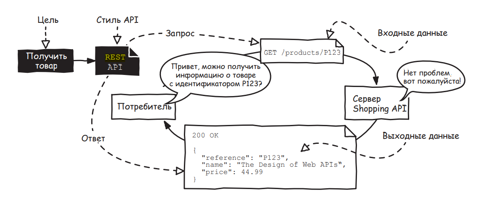

# REST API
REST (Representational State Transfer) — это способ создания API с помощью  HTTP протокола. 

Для того чтобы разобраться в REST API необходимо для начала познакомиться с протоколом HTTP, поскольку он неразрывно с ним связан и основывается на нем. 

# Базовые принципы HTTP
HTTP - это сетевой протокол, который позволяет передавать данные в текстовом виде (еще говорят, в виде гипертекста) между клиентом и удаленным сервером и расшировывается как HyperText Transfer Protocol. 

Как протокол, он задает собой список правил (формат), которые на текущий момент являются основой для обмена данными в сети Интернет. HTTP умеет передавать все возможные форматы файлов — например, видео, аудио, текст. Но при этом сами данные кодируются в виде текста по умолчанию.


### Описание HTTP-протокола: 

В протоколе участвуют две составляющие: 

- Клиент, который отправляет текстовый запрос на сервер (HTTP Request)
- Сервер, который на запрос клиента возвращает некий ответ (HTTP Response)

Как утверждалось ранее, протокол является текстовым, однако  структура запроса на сервер, как и  структура ответа от сервера имеет строгий формат и должен начинаться со служебного заголовка. Причем он отличается в случае запроса и в случае ответа от сервера.

### Формат запроса на сервер

Клиент после успешного подключения на сервер должен отправить текстовый запрос в следующем формате:

- `Path:` /about
- `Method:` {GET|POST|PUT|DELETE}
- `Headers:` {Authorization, Cookie, Content-type, Content-Size, Host}
- `Body:` {TEXT DATA}

В поле Path клиент указывает какой именной ресурс на сервере он хочет обратится. В поле Method клиент указывает серверу о том, какое действие над ресурсом он хочет выполнить. Далее идет серия заголовков, позволяющих  добавить некоторые метаданные к запросу, например, предпочитаемый формат ответа или язык (Accept Language). И в конце концов, если клиент выполняет загрузку либо модификацию данных на сервере, то он их указывает в текстовом виде в секции Body.


Например, HTTP запрос на скачивание логотипа сайта СГУ мог бы выглядеть следующим:

```yaml
GET /sites/all/themes/ssu_theme/logo.png HTTP/1.1
Host: www.sgu.ru
User-Agent: curl/7.64.1
Accept: */*
```


Перечень возможных значений поля Method ограничен следующими четырьмя:


- `GET` - получение данных или списка объектов с сервера
- `DELETE` - удаление данных
- `POST` - добавление или замена данных
- `PUT` - регулярное обновление данных


Структура HTTP ответа практически идентична, за исключением того, что  добавляется служебное поле код статуса ответа и его описания.  Сервер может закончить обработку запроса клиента с ошибкой и это поле как раз используется для того, чтобы сообщить об этом клиенту. 


Например, так выглядит тело ответа сервера СГУ на запрос о скачивании логотипа сайта. В данном случае, HTTP запрос выполнен с помощью консольной утилиты curl:
```sh
curl -D - https://www.sgu.ru/sites/all/themes/ssu_theme/logo.png 
```

```yaml
HTTP/1.1 200 OK
Server: nginx
Date: Sat, 03 Dec 2022 16:29:10 GMT
Content-Type: image/png
Content-Length: 27595
Last-Modified: Tue, 05 Feb 2013 14:19:38 GMT
Cache-Control: max-age=3600
X-Content-Type-Options: nosniff
X-Frame-Options: SAMEORIGIN
X-XSS-Protection: 1; mode=block
Cache-Control: private
Accept-Ranges: bytes

{Логотип сайта в текстовом виде}
```


## Подробнее о кодах ответа сервера в HTTP протоколе:

В протоколе HTTP огромное количество кодов ответов, которые обозначаются числами. Каждый из них имеет определенный смысл и сообщает клиенту статус отправленного запроса на сервер. 

Все коды ответа можно разделить на 4 группы:

- Коды 2XX говорят о том, что запрос был обработан сервером успешно
- Коды 3XX говорят о том, что сервер перенаправляет клиента на другой ресурс. Сам ресурс указывается в заголовке Location ответа от сервера. 
- Коды 4XX говорят о том, что клиент отправил некорректные данные в запросе и сервер их не принимает
- Коды 5XX говорят о неисправности  либо недоступности сервера

Примеры можно рассмотреть на таблице ниже:


## Почему возникла необходимость в RESTful API?

Сам по себе прокол HTTP появился задолго до REST API и в основном служил для доступа к статическим веб-сайтам на основе HTML.  Основным клиентом выступал браузер пользователя, который посылал запросы на удаленный сервер и отрисовывает страницу сайта. Чем дальше развивались технологии, тем больше росла потребность в обмене информацией, сервера могли отдавать динамическую информацию, которая менялась в режиме реального времени. Более того, клиентами удаленных серверов начинали становиться различные программы, не только браузер пользователя.  

Переход от статических HTML файлов на сервере к динамическим данным, которые, возможно, размещаются на еще одном удаленном сервере и замена клиента от браузера к другим программам (например, поисковым роботам), заставил задуматься о том, как упростить взаимодействие и о формализации интерфейса между клиентом и сервером. 

В таких условиях, сервер должен был иметь некий API, основой которого являлся бы HTTP как базовый протокол для обмена данными. Программист, чтобы взаимодействовать с удаленным сервером через этот API, должен разработать программу на некотором языке программирования.

Однако, HTTP как протокол слишком абстрактная система, не способная задать некий единый стиль написания API.  С ростом числа серверов, росло и разнообразие  подходов к тому, как были организованны интерфейсы этих серверов.   

Решить эту проблему и призван REST, как архитектурный стиль написания API. Программистом гораздо легче разрабатывать программы, когда API систем с которыми они взаимодействуют выглядит единообразно. 

## Основа REST

Ключевое в этом подходе - все есть ресурс.  Как мы уже ранее говорили, в HTTP протоколе основной является поле `path`, в котором клиент указывает путь до данных, к которым он хочет обратится. Раньше, когда сайты и интернет ресурсы были статическими, это буквально был путь на сервере до конкретной HTML страницы на его жестком диске. 

Но как организовать доступ к динамическим данным на сервере, например, к курсу валют или прогнозу погоды на определенный день?

Здесь нам и помогает REST, ключевые правила которого можно перечислить следующим образом:

- Данные на сервере определяются как некие ресурсы
- Доступ к ресурсу задается в поле HTTP Path запроса
- Каждый ресурс обладает идентификатором и состоянием на сервере 
- Поле HTTP Method задает глаголы взаимодействия с ресурсом на сервере 
- Статусы ответа сообщают клиенту о состоянии ресурса

### Проектируем RESTful API на примере

Проще всего продемонстрировать на примерах.  Представим, что мы хотим разработать RESTful API библиотеки СГУ. 

Что за ресурсы в нем могут быть ? Для этого зададим некоторую доменную область. В книжном магазине наверняка есть хотя бы один объект - это книга.

Дальше необходимо определиться с тем, что клиент может делать с ресурсами, другими словами задать глаголы над ними. Например, клиент может получить список книг, просмотреть  конкретную книгу, либо добавить новую. Чтобы все это стало возможным, каждый ресурс, в данном случае книга, должна обладать идентификатором, иметь уникальный номер. Иначе, клиент не сможет указать удаленному серверу, какая именно книга ему нужна.


Как бы выглядело это в REST API ? Во-первых нужно придумать путь до ресурса одного типа на сервере. В нашем случае это книги и можно использовать, например `/books`.  Дальше попробуем задать действия благодаря HTTP методам:

- `GET /books` - получить список книг
- `GET /books/{id}` - получить конкретную книгу по ее идентификатору 
- `PUT /books` - добавить новую книгу 

Сторонний разработчик прочитав такое описание нашего API может легко разобраться в том, какие ресурсы и какие действия мы предоставляем в нем.  

Однако, чтобы разработать программу, ему требуется знать о формате запросов и ответов на сервере, для того, чтобы взаимодействовать с ним и ответить на множество вопросов: как выглядит список книг? какую структуру имеет ответ от сервера в случае  получения конкретной книги ? что нужно отправить на сервер, чтобы добавить новую?

Другими словами, необходимо задать некий текстовый формат и структуру  данных, отправляемых на сервер, так и получаемых от него. Без этого говорить о том, что интерфейс взаимодействия задан и определен - нельзя.  

### Формат JSON

Как мы уже говорили, HTTP протокол сам по себе текстовый, однако, текст все же должен иметь некоторый формат, иметь структуру, чтобы клиент (одна программа) могла обратится к конкретным полям или свойствам ресурса другой программы - сервера.

Самым популярным текстовым форматом в RESTful API является JSON. Используя его, можно описать объекты, содержащие неупорядочные пары вида ключ-значения, списки и массивы. 

Практически в каждом современном языке программирования есть встроенные библиотеки, чтобы обрабатывать данные в формате JSON.  

Например, в языке программирования Python есть одноименный модуль:

```py
import json
json.loads('{"status":"error"}')
```

В случае нашего RESTful API библиотеки СГУ, мы могли бы задать ответ сервера на запрос клиента о конкретной книге следующим образом :

```
GET /books/500
```

Ответ от сервера в формате JSON:

```json
{
  "id": 500,
  "name": "Мастер и Маргарита",
  "author": "Булгаков",
  "pages": 600,
  "issue_date": 1967
}
```

Формат текстового запроса на добавление книги:
```
PUT /books
```

```json
{
  "name": "Мастер и Маргарита",
  "author": "Булгаков",
  "pages": 600,
  "issue_date": 1967
}
```

Получение идентификаторов существующих книг:

```
GET /books
```
Ответ от сервера в формате JSON:

```json
"books": [1, 2, 3, 4, 300, 500, 543]
```

## Короткие выводы о REST API

Таким образом, теперь мы получили полное описание нашего RESTful API

- Список доступных ресурсов (в нашем случае книга)
- Список доступных методов взаимодействия с ними (получить список, добавить)
- Формат и структуру данных в формате JSON

 
## Open API


Чтобы программистам было удобно описывать свой REST API и при этом не показывать исходный код сервера, существует стандарт под названием OpenAPI, позволяющий задать описание интерфейсов единым образом.  На текущий момент последняя версия OpenAPI это 3.0.3. 

Разработчик  в формате YAML [2](https://yaml.org/) описывает схему своего API

- Список доступных `paths`   - ресурсов сервера
- Список доступных` methods` у конкретного `path`
- Входные параметры запросов и их тип
- Схему возвращаемых объектов JSON в зависимости от кода ответа сервера

Например, выше описанный пример с API получения книги может быть описан в OpenAPI формате следующим образом [1](https://editor-next.swagger.io/):


Это отличный способ единым образом документировать свой REST API. Более того, можно автоматически генерировать исходный код клиентов к нашему API на различных языках программирования:


-----
### 

HTTP  независимый от языка программирования протокол, предназначенный для обмена документами между приложениями. Протокол HTTP используется широким спектором приложений, наиболее известными из которых являются веб-браузеры. Веб-браузер использует протокол HTTP для связи с веб-сервером, на котором размещен сайт. Когда вы набираете URL-адрес (например, 
http://apihandyman.io/about) в адресной строке браузера, он отправляет 
HTTP-запрос GET /about на сервер, где находится apihandyman.io, так 
же как когда потребитель API отправляет запрос на сервер REST API. Ответ, отправленный сервером, содержит код состояния 200 OK, за которым следует HTML-страница, соответствующая URL-адресу.
Браузеры используют этот протокол для извлечения любого типа ресурса (документа): HTML-страниц, CSS-файлов, файлов JavaScript, изображений и любых других документов, которые необходимы веб-сайту. 
Еще один пример http протокола, например, при загрузке фотографии на сайт социальной сети, браузер использует протокол HTTP, но на этот раз для отправки документа на сервер. В этом случае браузер отправляет запрос POST /photos с телом, содержащим файл 
изображения. Поэтому протокол HTTP также может использоваться для 
отправки содержимого ресурса.
HTTP-запросы и ответы всегда выглядят одинаково независимо от 
того, что запрашивается и каков результат обработки запроса.
Каким бы ни было его назначение, базовый HTTP-запрос содержит 
метод HTTP и путь к ресурсу на сервере. Метод HTTP указывает, что нужно сделать 
с ресурсом, который идентифицирует путь. Например, метод GET, используемый для получения ресурса, и POST, используемый 
для его отправки.
За этой первой частью запроса может следовать тело с содержимым 
ресурса, которое необходимо отправить на сервер, например для создания, обновления или замены ресурса.
Это содержимое может быть любого типа: документ в формате JSON, текстовый файл или фотография.
А ответ HTTP, возвращаемый сервером, всегда 
содержит код состояния и поясняющую фразу.
Это указывает на то, как 
прошла обработка запроса – была ли она успешной или нет.  За этой первой частью ответа может следовать тело с содержимым ресурса, которым манипулировал запрос.
Как и тело запроса, тип этого содержимого может быть любым.
Протокол HTTP кажется довольно простым. Но настолько ли просты REST API которые используют его запросы?


- https://developer.mozilla.org/en-US/docs/Web/HTTP/Overview#http_flow



